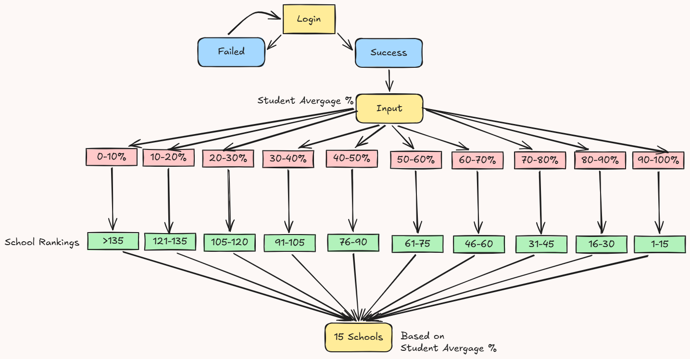

# Average success rate of HSC results in all high schools NSW for 2025
> Hypothesis: Students frequently enroll in the wrong schools due to a lack of data-driven selection tools that align institutional offerings with individual student capabilities.

> Problem being addressed: Students are not choosing the correct high schools for their secondary education due to lack of partnership between the students' capabilites and knowledge on how each high school is performing. Due to this many students are missing out on opportunities that they could have had otherwise if they had adequate knowledge on this topic.

> Purpose: By providing access to HSC performance data and capability-matching tools, this initiative ensures students make informed, data-driven decisions when choosing a high school.

> Goal: To guide students in choosing the correct high school for their secondary education. The program will accomplish this by displaying the success rate of each high school and the students will understand the school that is suitable for them based on all these factors.

> Preconditions:
- The student has to be logged into the system interface 
- The student has to be verified as a student with proper login credentials to access the system interface
- The program has to be showing selective schools only not the other ones
> Main Flow:
1. A student opens the system interface
2. They log in with their student credentials
3. Their login is successful
4. The program asks the student for their recent academic average
5. Based on the input, the program automatically chooses the right tier and displays Top 15 schools in descending order.
6. The schools are divided into 10 tiers based on their performance and each tier represents scores in 10% intervals
7. The program is successful and has acheived what is was made to

>Flowchart:

https://excalidraw.com/#json=MbwmoXpOBC2fkKLYx7AFt,p_Rl_ouvePotDhnwXBwv0Q

>Functional Requirements:

Data Loading File Formats: 
The system currently targets CSV format natively via pd.read_csv('data/HighSchools.csv'). It can be extended to support .txt (delimited text) or .xlsx (Excel files).

Data Analysis:
We need to calculate the actual overall benchmarks for all the matched institutions. We can find the average success rate easily by using the code matched_schools['HSC_Success_Rate'].mean().

Pandas Dataframes: Output clean, filtered tabular data for selected schools

Data Visualisation: Generate a horizontal bar chart (plt.barh) using matplotlib.pyplot to show individual school comparisons.

Data Reporting:
A list of recommended schools and a visual graph based on the student's marks will be generated, and the final dataset will be saved as a .csv file, which keeps the data organized in rows and columns for easy opening in Excel.

>Testing and Evaluation:

Bibliography:
https://www.matrix.edu.au/2025-high-school-rankings/

